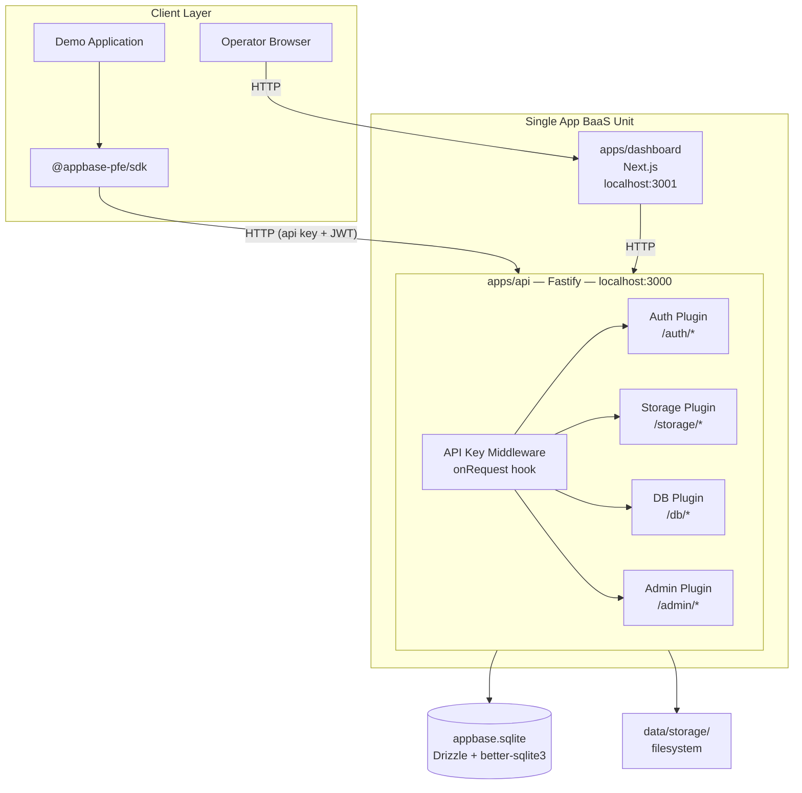
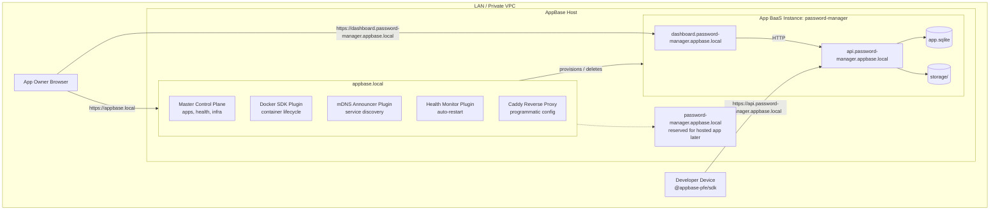
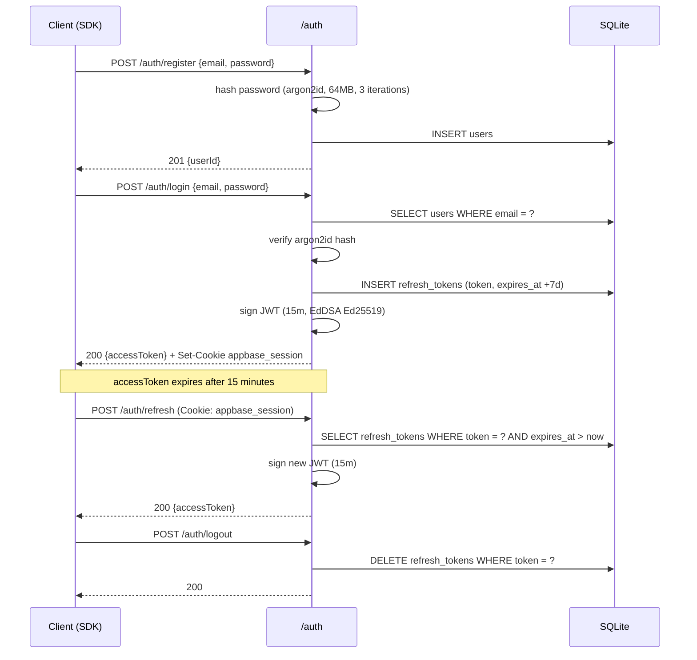
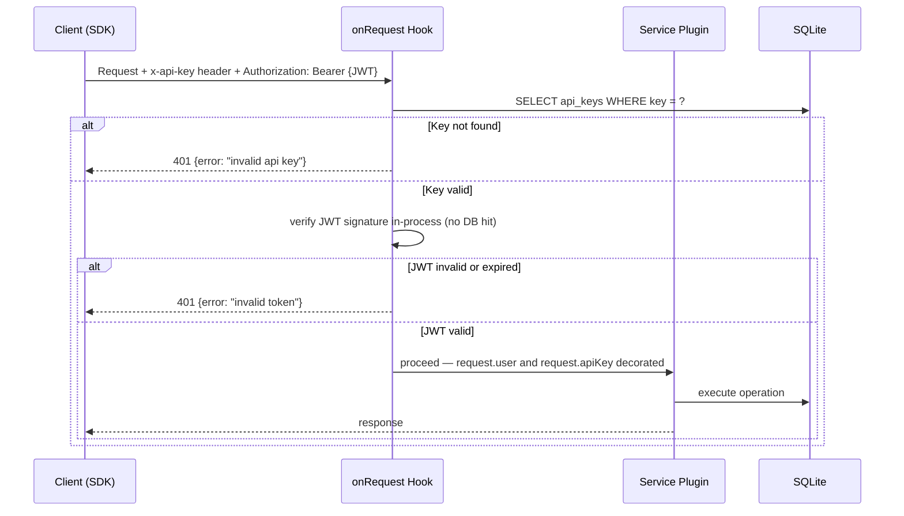
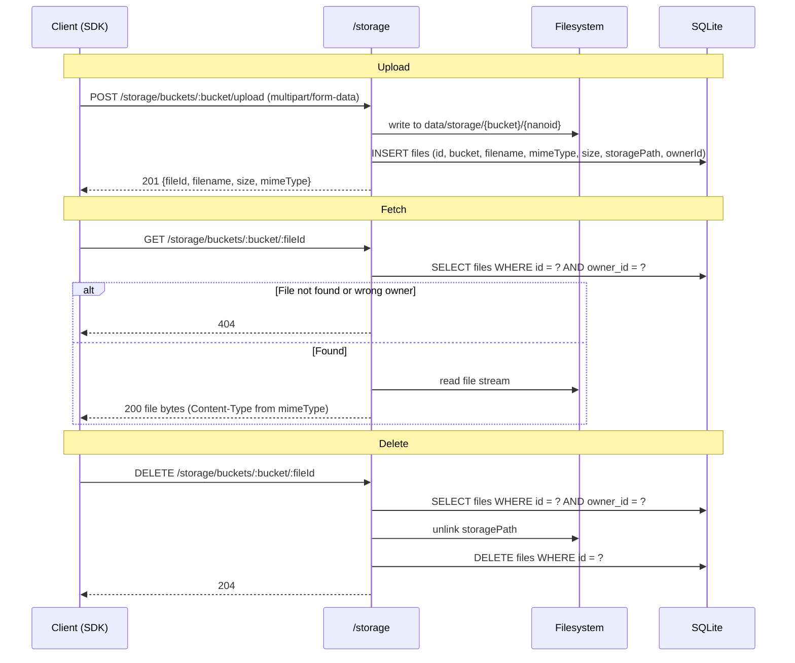
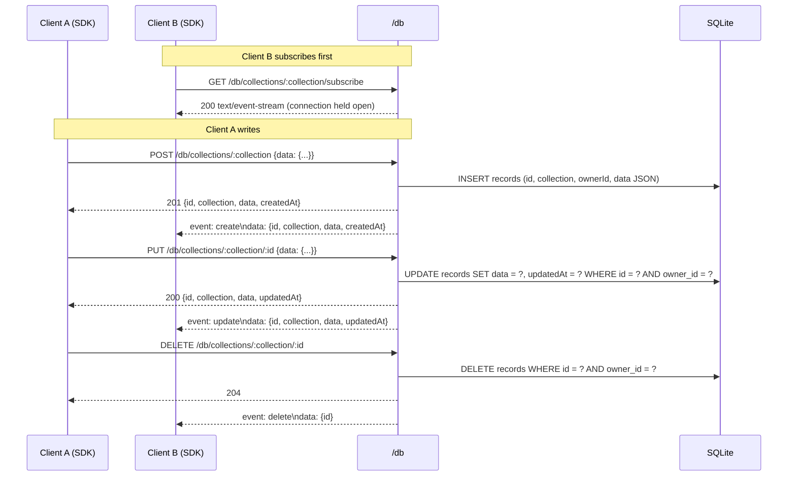

# AppBase — Architecture

> This document is the canonical architecture reference. It covers both the **current M1 architecture** and the **target platform architecture**. M1 is a real, single-app BaaS unit that ships first. The master control plane, multi-app provisioning, and subdomain routing are added later without changing the core BaaS service boundaries.

---

## Table of Contents

1. [Overview](#1-overview)
2. [Component Diagrams](#2-component-diagrams)
3. [Data Flow Diagrams](#3-data-flow-diagrams)
4. [Database Schema](#4-database-schema)
5. [API Surface Specification](#5-api-surface-specification)
6. [Port Allocation Strategy](#6-port-allocation-strategy)
7. [Data Persistence Directory Structure](#7-data-persistence-directory-structure)
8. [ADR Cross-References](#8-adr-cross-references)

---

## 1. Overview

**Current architecture — M1.** AppBase starts as a single app-scoped BaaS unit. That unit contains the BaaS API (`apps/api/`), the app-specific dashboard UI (`apps/dashboard/`), one SQLite database, one storage namespace, and the JS/TS SDK used by external applications. The dashboard and API belong to the same app instance: the dashboard is used to manage API keys, users, storage, records, and documentation for that one app, while the API serves the SDK and any client consuming the BaaS.

**Public contract boundary.** The public AppBase contract is the external API consumed by SDKs and client applications. It is documented separately in [`API-SPEC.md`](./API-SPEC.md). Dashboard authentication is intentionally excluded from that public contract and may use a separate browser-oriented auth mechanism.

**Target architecture — M2+.** Once the BaaS unit is stable, AppBase adds a master control plane at `appbase.local`. The master provisions and deletes app-specific BaaS instances, tracks health and infra state, manages port allocation, and eventually integrates reverse proxy routing, mDNS, and hosted app deployment. Each provisioned app gets its own BaaS unit with isolated DB and storage.

**Routing model.** The future routing model is intentionally reserved now to avoid renaming later:

- `appbase.local` — global master control plane
- `dashboard.<app>.appbase.local` — dashboard for one app's BaaS
- `api.<app>.appbase.local` — API for one app's BaaS
- `<app>.appbase.local` — reserved for the hosted user-facing application later

---

## 2. Component Diagrams

### Current Architecture — M1 Single-App BaaS Unit



### Target Platform Architecture — M2+ Master + App Instances



**M1 operating model.** The dashboard and API are packaged as one app-specific BaaS unit. There is no global master yet, no app provisioning flow, and no subdomain routing layer. The demo application is external and consumes the BaaS through the SDK. The dashboard is internal to that app instance and is not part of the public AppBase API contract.

**Role of `apps/master/` in M2+.** The master process is not an app data dashboard. It is the global control plane that provisions app instances and runs persistent background services as Fastify plugins with full `onReady`/`onClose` lifecycle hooks:

| Plugin | Responsibility |
|---|---|
| Docker SDK | Container creation, start, stop, destroy via `dockerode` |
| mDNS Announcer | Announces each running container on the LAN via `mdns`/Bonjour |
| Health Monitor | Periodic liveness checks against `/health` on each container; triggers auto-restart on failure |
| Caddy Config | Writes programmatic Caddy config entries when containers are created or destroyed |

The app-specific dashboard stays part of each app instance. The master stays focused on orchestration, infra, health, and routing metadata.

### 2.3 Instance Bootstrap and API Key Lifecycle

Each BaaS instance is **one app**. The API key identifies that app to the API. The lifecycle is:

**M1 — Instance bootstrap.** When the API starts, it checks whether an API key exists for this app. If none exists, it creates one automatically. The key is logged once at startup so the operator can copy it for use in the SDK or `.env`. This happens during the `onReady` (or equivalent) phase after the database is ready. No manual script is required for first-run setup.

**M2+ — Provisioning flow.** When the master provisions a new app via `POST /apps`, it creates the BaaS instance (container) and generates the first API key in the same step. The key is returned in the response and displayed in the master or app dashboard for the operator to copy. Same pattern as M1, but triggered by orchestration instead of local startup.

**One active key per instance.** One BaaS instance serves one application. Storing multiple valid keys would create ambiguity: which key should the app use, and how to revoke without affecting others. Therefore, at any time there is **at most one valid API key** per app instance. When the user requests key rotation (e.g. via the dashboard), the old key is revoked before or atomically with issuing the new one. The application must update its configuration with the new key; the old key immediately stops working.

The dashboard will expose the current API key for copy/paste (or a "Regenerate" action that performs rotate-in-place). Audit log entries record key creation and rotation.

---

## 3. Data Flow Diagrams

### 3.1 Authentication Flow



### 3.2 API Key Validation (Hot Path)

Applied to every route except `POST /auth/register` and `POST /auth/login` via Fastify `onRequest` hook.



### 3.3 Storage Flow



### 3.4 Database CRUD + SSE Real-Time



---

## 4. Database Schema

### M1 — Unified Schema

All tables live in a single file: `data/appbase.sqlite`. This database belongs to the single app-specific BaaS instance shipped in M1. Schema is defined in [`packages/db/src/schema/`](../packages/db/src/schema/) using Drizzle ORM and applied programmatically on startup via `drizzle-kit` migrations.

**`users`**

| Column | Type | Constraints |
|---|---|---|
| `id` | TEXT | PRIMARY KEY |
| `email` | TEXT | NOT NULL, UNIQUE |
| `password_hash` | TEXT | NOT NULL (argon2id) |
| `created_at` | INTEGER | NOT NULL (timestamp) |
| `updated_at` | INTEGER | NOT NULL (timestamp) |

**`refresh_tokens`**

| Column | Type | Constraints |
|---|---|---|
| `id` | TEXT | PRIMARY KEY |
| `user_id` | TEXT | NOT NULL, FK → `users.id` CASCADE DELETE |
| `token` | TEXT | NOT NULL, UNIQUE |
| `expires_at` | INTEGER | NOT NULL (timestamp, +7d) |
| `created_at` | INTEGER | NOT NULL (timestamp) |

**`api_keys`**

| Column | Type | Constraints |
|---|---|---|
| `id` | TEXT | PRIMARY KEY |
| `key` | TEXT | NOT NULL, UNIQUE (`hs_live_*` prefix) |
| `name` | TEXT | NOT NULL |
| `app_id` | TEXT | NOT NULL |
| `created_at` | INTEGER | NOT NULL (timestamp) |

**`files`**

| Column | Type | Constraints |
|---|---|---|
| `id` | TEXT | PRIMARY KEY |
| `bucket` | TEXT | NOT NULL |
| `filename` | TEXT | NOT NULL (original name) |
| `mime_type` | TEXT | NOT NULL |
| `size` | INTEGER | NOT NULL (bytes) |
| `storage_path` | TEXT | NOT NULL (filesystem path) |
| `owner_id` | TEXT | NOT NULL, FK → `users.id` CASCADE DELETE |
| `created_at` | INTEGER | NOT NULL (timestamp) |

**`records`**

| Column | Type | Constraints |
|---|---|---|
| `id` | TEXT | PRIMARY KEY |
| `collection` | TEXT | NOT NULL (developer-defined name) |
| `owner_id` | TEXT | NOT NULL, FK → `users.id` CASCADE DELETE |
| `data` | TEXT | NOT NULL (JSON, `Record<string, unknown>`) |
| `created_at` | INTEGER | NOT NULL (timestamp) |
| `updated_at` | INTEGER | NOT NULL (timestamp) |

**`audit_log`**

| Column | Type | Constraints |
|---|---|---|
| `id` | TEXT | PRIMARY KEY |
| `action` | TEXT | NOT NULL (e.g. `user.register`, `file.upload`) |
| `user_id` | TEXT | nullable |
| `resource` | TEXT | NOT NULL (e.g. `files`, `records`) |
| `resource_id` | TEXT | nullable |
| `metadata` | TEXT | nullable (JSON, `Record<string, unknown>`) |
| `created_at` | INTEGER | NOT NULL (timestamp) |

### M2+ — Split Schema

When the master control plane and multi-app provisioning are introduced, data splits into two database layers:

**`master.sqlite`** — owned by `apps/master/`, tracks the control plane:

| Table | Key Columns | Purpose |
|---|---|---|
| `registered_apps` | `id`, `name`, `slug`, `status`, `port`, `container_id`, `created_at` | One row per provisioned app |
| `port_assignments` | `port`, `app_id`, `assigned_at` | Port registry for dynamic allocation |

**`data/{appId}/app.sqlite`** — one file per registered app, contains the same 6 tables above (`users`, `refresh_tokens`, `api_keys`, `files`, `records`, `audit_log`), fully isolated. When an app is deleted via the master API, the whole BaaS instance is removed and the entire `data/{appId}/` directory is deleted.

---

## 5. API Surface Specification

The API surface evolves in two stages:

- **M1** — a single app-specific BaaS API (`apps/api/`) consumed by the SDK and by the app dashboard
- **M2+** — the same app-specific BaaS API plus a separate master API (`apps/master/`) for orchestration

The request/response-level public contract for the BaaS API is defined in [`API-SPEC.md`](./API-SPEC.md).

### App Container API — `apps/api/`

The service API — consumed by `@appbase-pfe/sdk` and by the app-specific dashboard. The public contract uses AppBase-owned routes such as `/auth/*`, `/storage/*`, and `/db/*` even if auth is implemented internally with `better-auth`. Storage and database routes require a valid `x-api-key` header plus an access-token bearer header for user-scoped operations.

| Method | Path | Auth | Description |
|---|---|---|---|
| POST | `/auth/register` | public | Create user account |
| POST | `/auth/login` | public | Verify credentials, issue JWT + refresh token |
| POST | `/auth/refresh` | refresh token | Rotate JWT (15m window) |
| POST | `/auth/logout` | bearer | Delete refresh token row |
| POST | `/storage/buckets/:bucket/upload` | api key + bearer | Upload file (multipart/form-data) |
| GET | `/storage/buckets/:bucket/:fileId` | api key + bearer | Download file (user-scoped) |
| DELETE | `/storage/buckets/:bucket/:fileId` | api key + bearer | Delete file (user-scoped) |
| GET | `/storage/buckets/:bucket` | api key + bearer | List bucket contents (user-scoped) |
| POST | `/db/collections/:collection` | api key + bearer | Create record |
| GET | `/db/collections/:collection` | api key + bearer | List records (user-scoped, filterable) |
| GET | `/db/collections/:collection/:id` | api key + bearer | Get single record |
| PUT | `/db/collections/:collection/:id` | api key + bearer | Update record |
| DELETE | `/db/collections/:collection/:id` | api key + bearer | Delete record |
| GET | `/db/collections/:collection/subscribe` | api key + bearer | SSE stream — real-time change events |
| GET | `/admin/users` | api key | List all users for the app |
| GET | `/admin/storage/usage` | api key | Storage usage statistics |
| GET | `/admin/audit-log` | api key | Paginated audit log |
| GET | `/health` | public | Liveness check |
| GET | `/docs` | public | Swagger UI (auto-generated from route schemas) |

Password reset remains dashboard-mediated in M1 and is therefore excluded from the public AppBase API contract.

### Master API — `apps/master/`

The control plane API — introduced in M2 and consumed from `appbase.local`. It manages app provisioning, lifecycle, routing metadata, and infra/health visibility. App-specific API keys, users, files, and records remain owned by each app instance rather than the master.

| Method | Path | Description |
|---|---|---|
| GET | `/apps` | List all registered apps with status |
| POST | `/apps` | Register new app — provisions container, assigns port, announces via mDNS |
| GET | `/apps/:id` | App detail: config, health, assigned port |
| DELETE | `/apps/:id` | Destroy container, reclaim port, wipe `data/{appId}/` |
| POST | `/apps/:id/keys` | Issue new API key scoped to this app |
| DELETE | `/apps/:id/keys/:keyId` | Revoke API key |
| GET | `/apps/:id/docs` | Proxied Swagger docs for the app container |
| GET | `/health` | Cluster health — status of all running containers |

---

## 6. Port Allocation Strategy

| Phase | Port | Process | Notes |
|---|---|---|---|
| M1 | `3000` | `apps/api/` | App-specific BaaS API |
| M1 | `3001` | `apps/dashboard/` | App-specific dashboard UI |
| M2+ | `80/443` | Edge entrypoint | Routes `appbase.local`, `dashboard.<app>`, `api.<app>` |
| M2+ | `3100–3999` | App BaaS instances | One upstream port assigned per app instance |

In M2+, each app-specific BaaS instance gets **one upstream port**. External subdomains route into that instance, and the instance dispatches dashboard traffic and API traffic internally.

**Allocation algorithm** (runs inside `apps/master/` at container creation time):

1. Query `port_assignments` for all currently assigned ports in range `3100–3999`
2. Find the lowest integer in that range not present in the result set
3. Write a new row to `port_assignments` atomically before spawning the container
4. On container deletion: `DELETE FROM port_assignments WHERE app_id = ?` — port re-enters the free pool immediately

This keeps port state in SQLite (durable, transactional) rather than in-memory, so it survives master process restarts.

---

## 7. Data Persistence Directory Structure

### M1

```
data/
├── appbase.sqlite          # All platform tables (users, tokens, api_keys, files, records, audit_log)
└── storage/
    └── {bucket}/           # Developer-defined bucket name
        └── {fileId}        # nanoid — actual file bytes, no extension
```

### M2+

```
data/
├── master.sqlite           # Control plane tables (registered_apps, port_assignments)
└── {appId}/                # One directory per provisioned app instance
    ├── app.sqlite          # Isolated app tables (same 6-table schema as M1)
    └── storage/
        └── {bucket}/
            └── {fileId}
```

When `DELETE /apps/:id` is called on the master API, the app-specific BaaS instance is removed and the entire `data/{appId}/` directory is deleted. This keeps the lifecycle clean: no orphaned files, no orphaned SQLite rows.

---

## 8. ADR Cross-References

Architecture decisions that shaped this document:

| ADR | Decision | Impact on This Document |
|---|---|---|
| [ADR-001 — API Framework Selection](./adr/ADR-001-api-framework-selection.md) | Fastify selected over Express, Hono, Elysia | Plugin-per-service architecture in §2; `onRequest` hook for API key validation in §3.2 |
| [ADR-002 — ORM and Migration Strategy](./adr/ADR-002-orm-and-migration-strategy.md) | Drizzle ORM + `better-sqlite3` + `drizzle-kit` | Schema tables in §4 sourced directly from `packages/db/src/schema/`; `createDb(path)` factory enables per-app SQLite in M2+ |
| [ADR-003 — Auth Implementation](./adr/ADR-003-auth-implementation.md) | 3-token model (refresh token + JWT + API key); argon2id hashing; EdDSA signing | Auth flow in §3.1; `refresh_tokens` and `api_keys` schema in §4; JWT-on-hot-path pattern in §3.2 |
| [ADR-004 — Database API Service](./adr/ADR-004-database-api-service.md) | Fastify `/db/*` plugin; `records` document model; owner isolation; in-process SSE | §3.4 sequence; `records` in §4; `/db/*` routes in §5; complements API-SPEC §7 |
| [ADR-005 — File Storage Strategy](./adr/ADR-005-file-storage-strategy.md) | FS-first storage driver abstraction; container volume persistence; metadata-based versioning | §3.3 storage flow, `files.storage_path` in §4, persistence layout in §7; complements API-SPEC §6 |
| [ADR-006 — Dashboard Implementation](./adr/ADR-006-dashboard-implementation.md) | Next.js operator console; BFF pattern for `x-api-key`; API key UX + rotation; admin surfaces | `apps/dashboard`; §5 admin routes; complements [DASHBOARD-SPEC.md](./DASHBOARD-SPEC.md) |
| [ADR-007 — SDK Package Distribution](./adr/ADR-007-sdk-package-distribution.md) | Public **npm** as default registry for `@appbase-pfe/sdk` (+ types); GitHub Packages not default | External developer installs; complements [TICKET-012](../tasks/TICKET-012-sdk-npm-publish-readiness.md) |
